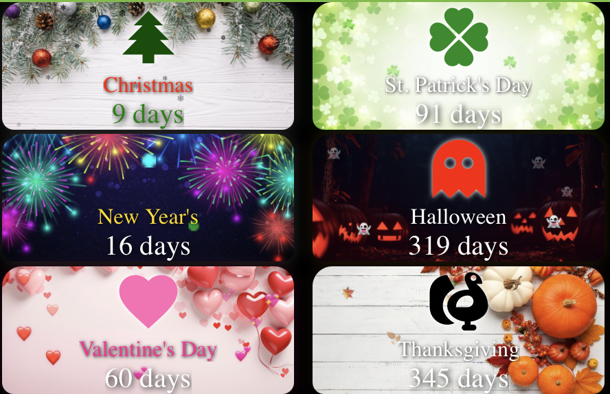

# Home Assistant Holiday Countdown Cards

This repository contains YAML configurations for Home Assistant Lovelace cards that display countdowns to various holidays.

## Prerequisites

To use these cards, you will need to have the following custom components installed from the Home Assistant Community Store (HACS):

*   [button-card](https://github.com/custom-cards/button-card)
*   [card-mod](https://github.com/thomasloven/lovelace-card-mod) (version 4 is required)

## Installation

1.  **Copy the files:**
    *   Place the `template.yaml` file in your Home Assistant `config` directory.


2.  **Include the template sensors:**
    Add the following line to your `configuration.yaml` file. If you already have a `template:` section, add the `!include` line under it.

    ```yaml
    template: !include template.yaml
    ```

3.  **Restart Home Assistant:**
    Restart your Home Assistant instance to load the new template sensors.
    ---

 Or....if you don't like messing with configuration files.

Go to your Helpers tab
<br>
Create Helper
<br>
Template --> Sensor
<br>
Give it the same name and paste it in from the single Holiday in templates.yaml

Example:
Name it "Days Until Christmas"

         {% set christmas = strptime(today.year ~ "-12-25", "%Y-%m-%d").date() %} 
      {% set christmas = strptime((today.year + 1) ~ "-12-25", "%Y-%m-%d").date() %}
     {{ (christmas - today).days }}

    

 ---   
    

## Card Configuration

Each card is a `custom:button-card`. To use them in your Lovelace dashboard, you can either copy the contents of the card's YAML file into a manual card, or use `!include` to include the card configuration from the file.

### Background Images

The cards use a background image. You can use any image you like.

1.  **Place the image in the `www` directory:**
    Place your desired background image in the `www` directory of your Home Assistant `config` folder. If the `www` directory does not exist, you will need to create it.

2.  **Reference the image in the card configuration:**
    In the card's YAML configuration, the background image is referenced using `/local/`. For example, if you place an image named `Christmas.jpg` in the `www` directory, the path in the card configuration should be `/local/Christmas.jpg`.

    ```yaml
    styles:
      card:
        - background-image: url("/local/Pictures/Christmas.jpg")
    ```

    You will need to update the `background-image` path in each card's configuration to point to the image you have chosen.

## Examples


### Video Example

▶️ [Watch a video of the cards in action!](Examples.mov)
<br>

